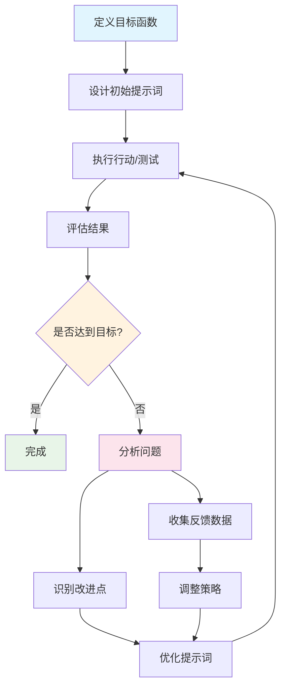

# PromptHub

提示词最关键的是建立目标函数，不断行动、评估、改进。

## 核心理念

通过建立明确的目标函数，形成闭环的优化流程：

```mermaid
flowchart TD
    A[定义目标函数] --> B[设计初始提示词]
    B --> C[执行行动/测试]
    C --> D[评估结果]
    D --> E{是否达到目标?}
    E -->|是| F[完成]
    E -->|否| G[分析问题]
    G --> H[识别改进点]
    H --> I[优化提示词]
    I --> C

    G --> J[收集反馈数据]
    J --> K[调整策略]
    K --> I

    style A fill:#e1f5fe
    style F fill:#e8f5e8
    style E fill:#fff3e0
    style G fill:#fce4ec
```

## 优化原则

1. **目标驱动**：明确定义成功标准
2. **持续迭代**：基于反馈不断改进
3. **数据支撑**：用客观指标评估效果
4. **闭环反馈**：建立完整的优化循环