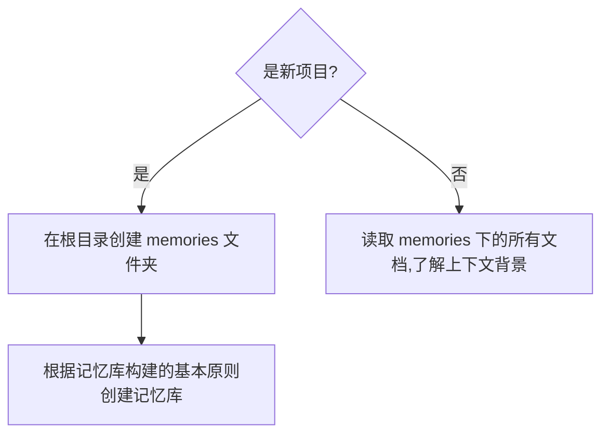

# 规划的基本原则

## 1.1 需求确认

- **不要编码**，让我们先讨论确定执行计划
- 请长时间思考，并提出你需要我补充的任何信息
- **复述需求**：在开始任何任务之前，首先**复述一遍需求**，以确保我知道你确实已经理解了需求。
- **主动澄清**：如果需求描述不够清晰或某些概念有模糊之处，**务必主动提出问题**，不要擅自揣测。

## 1.2 核心工作流

## 1.3 记忆库构建的基本原则

1. 在根目录下创建一个名为 `memories` 的文件夹，并进入该文件夹。
2. 创建一个名为 `PRD.md` 的文件，包含如下内容：

- 简单的项目描述，比如：一个简单的 Todo 应用。

- 主要技术栈。描述框架、语言、依赖库、工具、依赖的环境等。选择技术栈时候，遵循以下原则：

  - 前端使用：Vue.js + TypeScript
  - 后端Frontend: Python或Node.js
  - CSS 使用tailwind/shadcn 的 theme

  - NextJS 15

  - shadcn/ui，必须支持 theme

  - 多语言版本的支持：默认中文，支持选择英语，先只做这个两种语言
    - next-intl 用于

  - 注册登录
    - 使用 better-auth实现。
    - 登录：email/password 登录，并且支持 Google 登录，其中，Google 登录还需要 one-tap

  - 数据库使用Postgres
    - 我会用 neon.tech 来给你一个连接字符串放在.env 中
    - drizzle 数据库，读取、迁移等，包括 migrate

  - 订阅支付:creem
  - legal: 法律相关，一定要有。

3. 项目的执行基本原则

- 在文档中，使用 `mermiad` 绘制出项目的基本结构
- 执行计划的步骤应该小而具体
- **MPV 原则**：从最核心的模块开始，先构架最小可运行的产品原型
- **模块化原则**：把开发任务，拆分成多个独立的功能模块，以ToDo list 清单形式，写入issue.md中
- **单模块原则**：如果模块太大，可以拆分成多个子模块，尽可能降低单次需要完成的任务的难度
