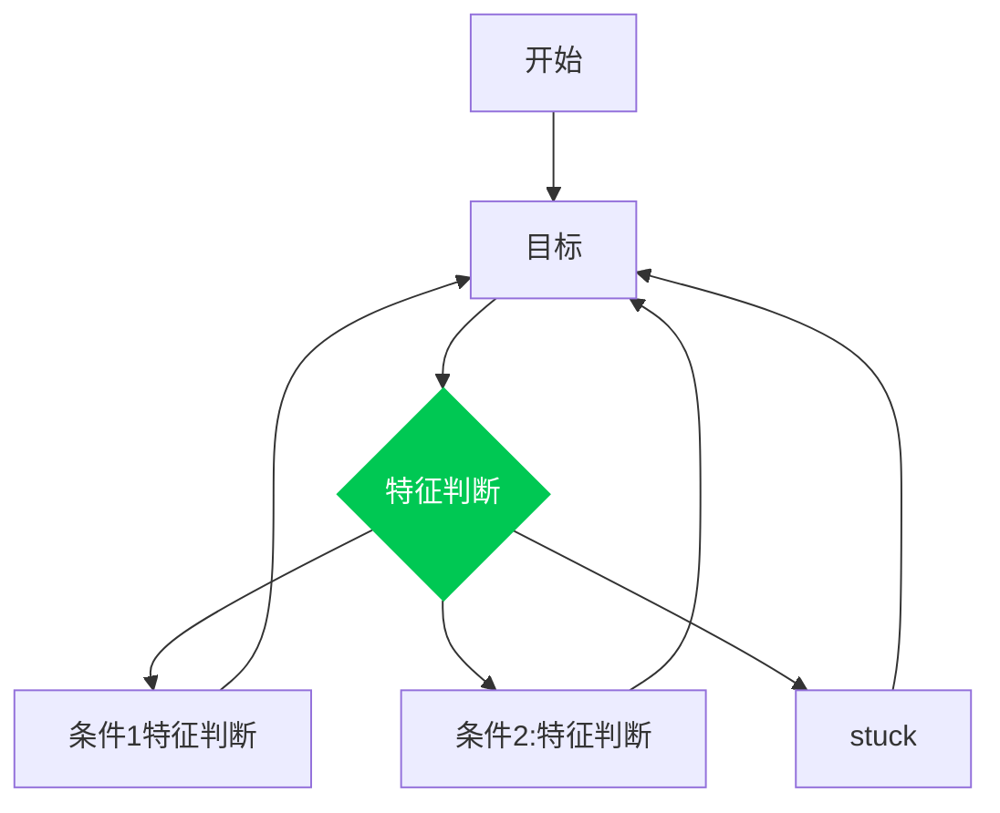

## 基本原理

基于过去经验的归纳总结，不断完善 AI Agent 的流程，通过特征判断，形成条件

## coreWorkflow

```mermaid
graph TB
%% 节点
    A[开始]
    B[目标]
    C{特征判断}
    D[条件1特征判断]
    E[条件2:特征判断]
    F[stuck]

%%边 节点之间的关系
    A-->B
    B-->C
    C-->D
    C-->E
    C-->F
    D-->B
    E-->B
    F-->B

    
%% 独立节点的样式设置
    style C color:#FFFFFF, fill:#00C853, stroke:#00C853
```
